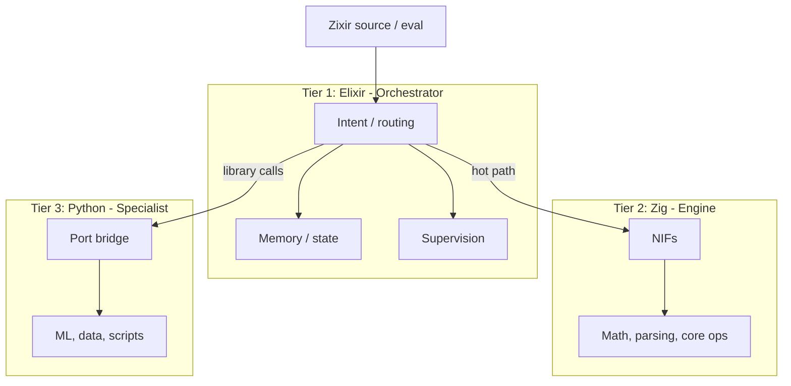

# Zixir

<p align="center"></p>

**Repository:** [github.com/Zixir-lang/Zixir](https://github.com/Zixir-lang/Zixir)

Zixir is an **AI automation language** that bakes workflow orchestration, resource limits, and observability into one runtime—no Airflow + Redis + Prometheus glue. Small, expression-oriented, on a **three-tier runtime**: **Elixir** (orchestrator), **Zig** (engine), **Python** (specialist).

**Who it's for:** Developers and teams building AI automation, agentic workflows, and ML pipelines who prefer a single, expression-oriented language and runtime over managing Airflow, K8s, Redis, and custom YAML. Best fit for engineers who like Elixir/FP, want pattern matching and type inference, and need built-in fault tolerance and observability without extra infra.

## Why Zixir?

**Problem:** Production AI pipelines usually need Airflow, K8s, Redis, Prometheus, custom fault-tolerance code, and YAML.

**Solution:** One language. Orchestration, checkpointing, resource limits, circuit breakers, and built-in caching (ETS + disk, no Redis) are in the runtime.

| Strength | Trade-off |
|----------|-----------|
| Built-in caching (ETS + disk) | — |
| Pattern matching (native; unique among workflow tools) | — |
| Interactive REPL | — |
| Fault tolerance (supervision, circuit breakers, retries) | — |
| Less infra, faster dev, type safety | Learning Elixir/Zixir; smaller ecosystem; newer project |

## Why a three-tier runtime?

Each tier does one job well; together: orchestration, speed, and ecosystem.

| Tier | Role | Strength |
|------|------|----------|
| **Elixir** | Orchestrator | Concurrency, fault tolerance, supervision (“let it crash”), OTP. Coordinates tasks and keeps the system up. |
| **Zig** | Engine | Predictable performance, no GC, small binaries. Hot paths: parsing, math, core ops (NIFs). |
| **Python** | Specialist | ML (PyTorch, TensorFlow), data (pandas, numpy), APIs. Use existing libraries without rewriting. |

Elixir orchestrates and restarts failed workers; Zig runs hot-path code; Python handles ML and data. Good fit for agentic/AI tooling and teams that want FP (pattern matching, type inference) plus built-in fault tolerance.

### Zixir vs. alternatives (honest assessment)

| Feature | Zixir | Airflow | Kubeflow | Prefect |
|---------|-------|---------|----------|---------|
| **External infrastructure** | Elixir runtime only* | Redis + DB | Kubernetes | Minimal |
| **Setup time** | ~20 min | ~2 hours | ~2 days | ~1 hour |
| **Lines of code (typical ML pipeline)** | 50–150 | 200–500 | 500–1000 | 150–400 |
| **Workflow orchestration** | ✅ Built-in | ✅ | ✅ | ✅ |
| **Checkpointing** | ✅ Any type | ⚠️ JSON only (XCom) | ✅ | ✅ |
| **Resource limits** | ✅ Code-level primitives | ✅ Config (e.g. execution_timeout) | ✅ YAML | ✅ Decorators |
| **Fault tolerance** | ✅ Supervision + circuit breakers | ⚠️ Basic | ⚠️ K8s | ⚠️ Basic |
| **Observability** | ✅ Built-in | ⚠️ Manual | ⚠️ Complex | ⚠️ UI |
| **Pattern matching** | ✅ Native | ❌ | ❌ | ❌ |
| **Interactive REPL** | ✅ | ❌ | ❌ | ❌ |
| **Type inference** | ✅ | ❌ | ❌ | ❌ |
| **Native performance** | ✅ Zig NIFs | ❌ | ❌ | ❌ |

\* Elixir + Zig (build-time) required; no Redis, K8s, or separate DB for workflows.

**Bottom line:** Zixir puts orchestration, resource limits, and observability in the language—so you don’t glue Airflow + Redis + Prometheus. Requires Elixir and Zig; once set up, you get what usually needs 3–5 external services. Strong for teams that want FP (pattern matching, type inference) and built-in fault tolerance.

### Layout (three-tier flow)



## Requirements

| Requirement | Notes |
|-------------|--------|
| **Elixir** 1.14+ / OTP 25+ | Runtime |
| **Zig** 0.15+ | Build-time only; run `mix zig.get` after `mix deps.get` (Zigler) |
| ~100 MB disk, file system | For persistence, checkpoints, cache |
| **Python** 3.8+ *(optional)* | For ML/specialist calls; set `config :zixir, :python_path` if not on PATH |

**Platforms:** Windows, macOS, Linux. Zigler compiles NIFs at `mix compile`; Python script: `priv/python/port_bridge.py`.

## Entry point (agentic extension)

- `Zixir.run_engine(op, args)` — hot path (math, data) → Zig
- `Zixir.call_python(module, function, args)` — library calls → Python

Intent and routing live in `Zixir.Intent`.

## Setup

```bash
mix deps.get
mix zig.get   # after deps.get, for Zigler
mix compile
```

For Python specialist: ensure Python is on `PATH` or set in config; recommend a virtualenv.

## Usage

### Zixir language (source)

Run Zixir source with `eval/1` or `run/1`:

```elixir
Zixir.eval("engine.list_sum([1.0, 2.0, 3.0])")
# => {:ok, 6.0}

Zixir.run("let x = 5\nlet y = 5\nx + y")
# => 10
```

Run a `.zixir` file:

```bash
mix zixir.run examples/hello.zixir
```

Grammar, types, and standard library: see [docs/LANGUAGE.md](docs/LANGUAGE.md).

### Elixir API

- `Zixir.run_engine/2` — hot path (math, data) → Zig NIFs
- `Zixir.call_python/3` — library calls → Python via port

See [project_Analysis_for_fork.md](project_Analysis_for_fork.md) for architecture and failure model.

## Test

```bash
mix test
```

## Verification

```bash
mix deps.get && mix zig.get && mix compile && mix test && mix zixir.run examples/hello.zixir
```

Expected: tests pass; `examples/hello.zixir` prints `11.0`. On Windows: `scripts\verify.ps1`. If "mix is not recognized", install [Elixir](https://elixir-lang.org/install.html#windows) and add to PATH.

## License

**Apache-2.0** — see [LICENSE](LICENSE).
