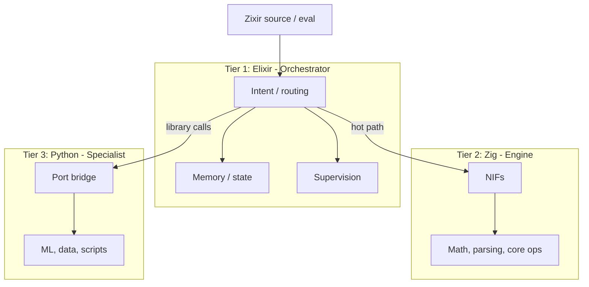

# Zixir

<p align="center"></p>

**Repository:** [github.com/Zixir-lang/Zixir](https://github.com/Zixir-lang/Zixir)

Zixir is an **AI automation language** that bakes workflow orchestration, resource limits, and observability into one runtime—no Airflow + Redis + Prometheus glue. Small, expression-oriented, on a **three-tier runtime**: **Elixir** (orchestrator), **Zig** (engine), **Python** (specialist).

**Zixir is its own language** (own grammar and semantics), implemented with Elixir, compiling to Zig, and calling into Python. You write `.zixir` source; it is not Elixir or Zig syntax.

**Who it's for:** Developers and teams building AI automation, agentic workflows, and ML pipelines who prefer a single, expression-oriented language and runtime over managing Airflow, K8s, Redis, and custom YAML. Best fit for engineers who like Elixir/FP, want pattern matching and type inference, and need built-in fault tolerance and observability without extra infra.

## Why Zixir?

**Problem:** Production AI pipelines usually need Airflow, K8s, Redis, Prometheus, custom fault-tolerance code, and YAML.

**Solution:** One language. Orchestration, checkpointing, resource limits, circuit breakers, and built-in caching (ETS + disk, no Redis) are in the runtime.

| Strength | Trade-off |
|----------|-----------|
| Built-in caching (ETS + disk) | — |
| Pattern matching (native; unique among workflow tools) | — |
| Interactive REPL | — |
| Fault tolerance (supervision, circuit breakers, retries) | — |
| Less infra, faster dev, type safety | Learning Elixir/Zixir; smaller ecosystem; newer project |

## Why a three-tier runtime?

Each tier does one job well; together: orchestration, speed, and ecosystem.

| Tier | Role | Strength |
|------|------|----------|
| **Elixir** | Orchestrator | Concurrency, fault tolerance, supervision (“let it crash”), OTP. Coordinates tasks and keeps the system up. |
| **Zig** | Engine | Predictable performance, no GC, small binaries. Hot paths: parsing, math, core ops (NIFs). |
| **Python** | Specialist | ML (PyTorch, TensorFlow), data (pandas, numpy), APIs. Use existing libraries without rewriting. |

Elixir orchestrates and restarts failed workers; Zig runs hot-path code; Python handles ML and data.

### How it works

Zixir has its **own grammar** (`let`, expressions, `engine.op(args)`, `python "module" "function" (args)`, literals, binary ops). Source is **parsed** in Elixir into a Zixir AST, then either:

- **Interpreted** — `Zixir.eval(source)` evaluates the AST in Elixir; `engine.*` calls run in Zig NIFs, `python` calls go to Python via a port.
- **Compiled** — `Zixir.Compiler.compile(source)` type-checks, optimizes, and **emits Zig**; the Zig is compiled to a native binary or run JIT.

Your code stays Zixir-only; the runtime is Elixir + Zig (engine/codegen) + Python (libraries).

### Zixir vs. alternatives (honest assessment)

| Feature | Zixir | Airflow | Kubeflow | Prefect |
|---------|-------|---------|----------|---------|
| **External infrastructure** | Elixir runtime only* | Redis + DB | Kubernetes | Minimal |
| **Setup time** | ~20 min | ~2 hours | ~2 days | ~1 hour |
| **Lines of code (typical ML pipeline)** | 50–150 | 200–500 | 500–1000 | 150–400 |
| **Workflow orchestration** | ✅ Built-in | ✅ | ✅ | ✅ |
| **Checkpointing** | ✅ Any type | ⚠️ JSON only (XCom) | ✅ | ✅ |
| **Resource limits** | ✅ Code-level primitives | ✅ Config (e.g. execution_timeout) | ✅ YAML | ✅ Decorators |
| **Fault tolerance** | ✅ Supervision + circuit breakers | ⚠️ Basic | ⚠️ K8s | ⚠️ Basic |
| **Observability** | ✅ Built-in | ⚠️ Manual | ⚠️ Complex | ⚠️ UI |
| **Pattern matching** | ✅ Native | ❌ | ❌ | ❌ |
| **Interactive REPL** | ✅ | ❌ | ❌ | ❌ |
| **Type inference** | ✅ | ❌ | ❌ | ❌ |
| **Native performance** | ✅ Zig NIFs | ❌ | ❌ | ❌ |
| **LSP Support** | ✅ `mix zixir.lsp` | ❌ | ❌ | ❌ |

\* Elixir + Zig (build-time) required; no Redis, K8s, or separate DB for workflows.

**Bottom line:** One language replaces the usual Airflow + Redis + Prometheus stack. Requires Elixir and Zig; once set up, you get orchestration, limits, and observability without 3–5 external services.

### Layout (three-tier flow)



## Requirements

| Requirement | Notes |
|-------------|--------|
| **Elixir** 1.14+ / OTP 25+ | Runtime |
| **Zig** 0.15+ | Build-time only; run `mix zig.get` after `mix deps.get` (Zigler) |
| ~100 MB disk, file system | For persistence, checkpoints, cache |
| **Python** 3.8+ *(optional)* | For ML/specialist calls; set `config :zixir, :python_path` if not on PATH |

**Platforms:** Windows, macOS, Linux. Zigler compiles NIFs at `mix compile`; Python script: `priv/python/port_bridge.py`.

**New to Zixir?** For step-by-step install of Elixir, Zig, and Python per OS, see [SETUP_GUIDE.md](SETUP_GUIDE.md).

## Setup

From a clone of the repo:

```bash
mix deps.get
mix zig.get   # after deps.get, for Zigler
mix compile
```

For Python specialist: ensure Python is on `PATH` or set in config; recommend a virtualenv.

## Usage

### Zixir language (source)

Run Zixir source with `eval/1` or `run/1`:

```elixir
Zixir.eval("engine.list_sum([1.0, 2.0, 3.0])")
# => {:ok, 6.0}

Zixir.run("let x = 5\nlet y = 5\nx + y")
# => 10
```

Run a `.zixir` file (from repo root):

```bash
mix zixir.run examples/hello.zixir
```

**Run from any directory:** Build a release (`mix release`), add `_build/prod/rel/zixir/bin` to PATH, then use `zixir_run.sh` / `zixir_run.bat` with a path to a `.zixir` file. See [SETUP_GUIDE.md](SETUP_GUIDE.md#global--portable-cli-run-from-any-directory).

Grammar, types, and standard library: see [docs/LANGUAGE.md](docs/LANGUAGE.md).

**Elixir API:** `Zixir.run_engine/2` (hot path → Zig NIFs), `Zixir.call_python/3` (library calls → Python). Intent/routing: `Zixir.Intent`. See [project_Analysis_for_fork.md](project_Analysis_for_fork.md) for architecture.

## Test

```bash
mix test
```

## Verification

After Setup, run `mix zixir.run examples/hello.zixir`. Expected: `11.0`. Windows: `scripts\verify.ps1`. If "mix is not recognized", install [Elixir](https://elixir-lang.org/install.html#windows) and add to PATH.

## Implementation Status

### ✅ Fully Implemented

| Feature | Status | Notes |
|---------|--------|-------|
| Parser | Complete | Recursive descent; tokenization, expressions, control flow, comprehensions |
| Engine NIFs | Complete | 20+ Zig operations (sum, product, dot, etc.) |
| Zig Backend | Complete | Codegen, functions, optimization passes |
| Type System | Complete | Inference, lambda/map/struct types |
| MLIR | Complete | Text generation + optimizations (CSE, constant folding, LICM) |
| Quality/Drift | Complete | Validation, detection, auto-fix |
| Experiment | Complete | A/B testing framework, statistics |
| Python Port | Working | `Zixir.call_python/3` via ports |
| Workflow | Complete | Steps, retries, checkpoints, sandboxing |
| Observability | Complete | Logging, metrics, tracing, alerts |
| Cache | Complete | ETS + disk caching |
| CLI/REPL | Working | All commands functional |
| Portable CLI | Working | `zixir_run.sh` / `zixir_run.bat` from release; run from any path |
| LSP Server | ✅ Ready | `mix zixir.lsp` + VS Code integration |
| Package Manager | Complete | `Zixir.Package`: resolve, install (Git/path), list, cache; `zixir.toml` manifest |

### ⚠️ Partially Implemented

| Feature | Status | Notes |
|---------|--------|-------|
| Python FFI | Implemented | Port-based (PythonFFI) default; NIF path (PythonNIF + `priv/python_nif.zig`) when NIF built; `Zixir.Python` auto-selects |
| GPU | Implemented | Detection (CUDA/ROCm/Metal); codegen, compile, and launcher execution; requires nvcc/hipcc/Metal SDK |

### ❌ Aspirational / Not Implemented

None at this time.

**Note:** See [PROJECT_ANALYSIS.md](PROJECT_ANALYSIS.md) for detailed implementation status.

## License

**Apache-2.0** — see [LICENSE](LICENSE).
