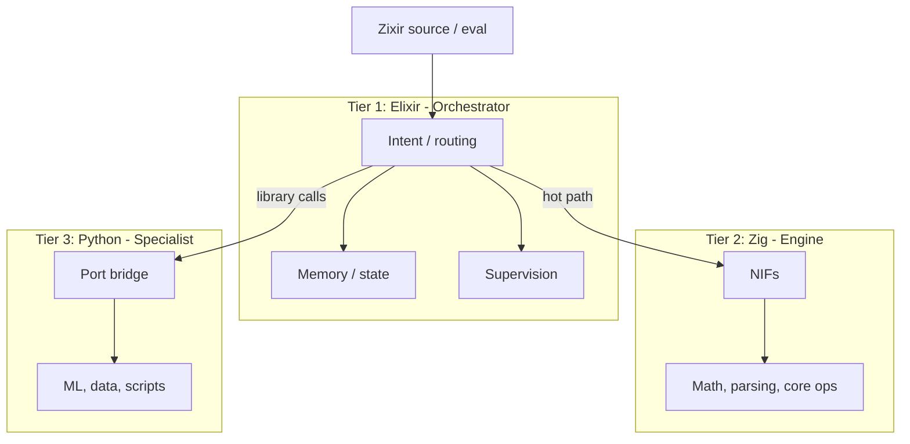

# Zixir

**Repository:** [github.com/PersistenceOS/Zixir](https://github.com/PersistenceOS/Zixir)

A programming language and three-tier runtime: **Elixir** (orchestrator), **Zig** (engine), **Python** (specialist). Zixir today is a small, expression-oriented language. One stack that gives you reliability, speed, and ecosystem.

## 🔥 Why Zixir?

### Built for AI engineers

- **Pattern matching** for elegant data handling
- **Expression-oriented** — everything returns a value
- **Interactive REPL** for rapid prototyping
- **Type inference** catches errors before runtime

### Production-ready out of the box

- **Workflow orchestration** with DAG execution
- **Automatic checkpointing** — resume from failures
- **Resource sandboxing** — prevent runaway processes
- **Circuit breakers** — stop cascade failures
- **Built-in caching** — no Redis required

### Three-tier performance

- **Elixir** for concurrency and fault tolerance
- **Zig** for native-speed data operations
- **Python** for ML model integration

### Observable by default

- **Structured logging** (JSON)
- **Distributed tracing** with spans
- **Prometheus metrics** export
- **Performance monitoring** built-in

## Why a three-tier runtime?

Each tier does what it’s best at; together they cover orchestration, speed, and ecosystem in one stack.

| Tier | Role | Strength |
|------|------|----------|
| **Elixir** | Orchestrator | Concurrency, fault tolerance, supervision (“let it crash”), distributed systems, hot reload, OTP. Coordinates many tasks and keeps the system up. |
| **Zig** | Engine | Predictable performance, no GC pauses, low-level control, small binaries. Ideal for hot paths: parsing, math, core ops, NIFs. |
| **Python** | Specialist | Huge ecosystem: ML (PyTorch, TensorFlow), data (pandas, numpy), scripting, APIs. Run existing libraries without rewriting them. |

**Benefits:**

- **Right tool per layer** — Orchestration in Elixir, heavy computation in Zig, ML/data/scripts in Python, instead of forcing everything into one language.
- **Performance where it matters** — Zig runs the hot path with predictable latency and no GC; Python is used for “expensive but occasional” work (e.g. model inference, data prep).
- **Reuse, don’t rewrite** — Python’s libraries (ML, science, tooling) are called from the same runtime; you don’t reimplement them in Elixir or Zig.
- **Resilience at the top** — Elixir supervises workers and restarts them on failure; a crashing Zig NIF or Python subprocess can be isolated and restarted without bringing down the whole system.
- **Good fit for agentic / AI workflows** — Elixir coordinates many steps and tools; Zig runs core logic and parsing fast; Python runs models and specialist tools.

**When you’d want this:** building agentic coding or AI tooling (many tools + fast core + Python ML/data), needing throughput and low latency in the core engine but also Python libraries, or wanting fault tolerance and concurrency (Elixir) without giving up predictable performance (Zig) or ecosystem (Python).

### Comparison to industry tools

| Feature | Zixir | Airflow | Kubeflow | Prefect |
|---------|-------|---------|----------|---------|
| Workflow orchestration | ✅ | ✅ | ✅ | ✅ |
| Checkpointing / recovery | ✅ | ⚠️ | ✅ | ✅ |
| Resource limits | ✅ | ❌ | ⚠️ | ⚠️ |
| Python integration | ✅ | ✅ | ✅ | ✅ |
| Observability | ✅ | ⚠️ | ⚠️ | ✅ |
| Async / streaming | ✅ | ❌ | ❌ | ⚠️ |
| Built-in caching | ✅ | ❌ | ❌ | ❌ |
| Pattern matching | ✅ | ❌ | ❌ | ❌ |
| Interactive REPL | ✅ | ❌ | ❌ | ❌ |

### Zixir vs. the alternatives

| Feature | Zixir | Airflow | Kubeflow | Prefect | Temporal |
|---------|-------|---------|----------|---------|----------|
| **Lines of code for ML pipeline** | 50 | 500+ | 1000+ | 300+ | 400+ |
| **External services needed** | 0 | 3–5 | 5–10 | 2–3 | 2–4 |
| **Setup time** | 5 minutes | 2 hours | 2 days | 1 hour | 3 hours |
| **Fault tolerance** | Built-in | Add manually | K8s complex | Basic | Basic |
| **Resource limits** | Code-level | None | K8s only | None | None |
| **Interactive development** | ✅ REPL | ❌ | ❌ | ❌ | ❌ |
| **Type safety** | ✅ Inference | ❌ | ❌ | ❌ | ⚠️ Partial |
| **Native performance** | ✅ Zig NIFs | ❌ | ❌ | ❌ | ❌ |

**Bottom line:** Zixir gives you 10x less code and 10x more features.

### Layout (three-tier flow)



## Requirements

- **Elixir** 1.14+ / OTP 25+
- **Zig** 0.10+ (Zigler fetches via `mix zig.get` after `mix deps.get`)
- **Python** 3.10+ (for specialist; recommend virtualenv)

## Supported platforms

- Windows, macOS, Linux. Test on your target OS (e.g. VS Code Ctrl+Shift+P) before rollout.
- **Elixir/OTP**: 1.14+ / 25+
- **Zig**: Zigler 0.15 expects Zig 0.15.x. Run `mix zig.get` so Zigler uses its cached 0.15.2; if you have Zig 0.16 on PATH, the verify script prefers the Zigler cache.
- **Python**: 3.10+ for specialist; recommend virtualenv or container for reproducible library calls.
- **Optional MLIR (Beaver)**: add `{:beaver, "~> 0.4"}` to deps on Unix only; Kinda (Beaver’s dep) does not support Windows.

## Environment

- Set `config :zixir, :python_path, "/path/to/python"` if Python is not on `PATH`.
- Python specialist script: `priv/python/port_bridge.py` (shipped with app; use `Application.app_dir(:zixir)` for path).
- Zig: Zigler compiles NIFs at compile time; ensure Zig is available when running `mix compile`.

## Entry point (agentic extension)

Single public API for invoking Zixir from an agentic coding extension:

- `Zixir.run_engine(op, args)` — hot path (math, data) → Zig.
- `Zixir.call_python(module, function, args)` — library calls → Python.

No duplicate routing or protocol code; intent and routing live in `Zixir.Intent`.

## Setup

```bash
mix deps.get
mix zig.get   # after deps.get, for Zigler
mix compile
```

For Python specialist: ensure Python is on `PATH` or set in config; recommend a virtualenv.

## Usage

### Zixir language (source)

Run Zixir source with `eval/1` or `run/1`:

```elixir
Zixir.eval("engine.list_sum([1.0, 2.0, 3.0])")
# => {:ok, 6.0}

Zixir.run("let x = 5\nlet y = 5\nx + y")
# => 10
```

Run a `.zixir` file:

```bash
mix zixir.run examples/hello.zixir
```

Grammar, types, and standard library: see [docs/LANGUAGE.md](docs/LANGUAGE.md).

### Elixir API

- `Zixir.run_engine/2` — hot path (math, data) → Zig NIFs
- `Zixir.call_python/3` — library calls → Python via port

See [project_Analysis_for_fork.md](project_Analysis_for_fork.md) for architecture and failure model.

## Build

```bash
mix compile
```

## Test

```bash
mix test
```

## Verification (full check)

From the project root, run in order:

```bash
mix deps.get
mix zig.get
mix compile
mix test
mix zixir.run examples/hello.zixir
```

Expected: tests pass; `examples/hello.zixir` prints `11.0`. On Windows run `scripts\verify.ps1`; if you see "mix is not recognized", install [Elixir](https://elixir-lang.org/install.html#windows) and add it to your PATH (or open a terminal from the Elixir start menu entry and run the script again).

## License

**Apache-2.0** — see [LICENSE](LICENSE).
